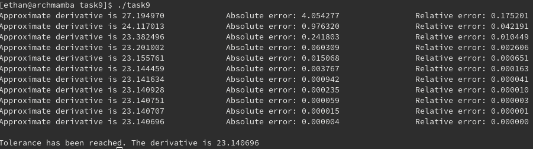

## Derivative of Exponential Function at pi (Task Sheet 1 - Task 9)
[Link to code](../tasks_source/task_sheet_1/task_9/)

The link above directs to the folder where all of the relevant work for this problem resides. A copy of the shared library has been made in the directly along with the needed header files for the library to work correctly.

In this program, we incrementally make h smaller and smaller for the approximation of the derivative using the central difference technique. We set the error to be the absolute error (using the shared library) of that number and the true value of the derivative of the exponential function at pi. The relative error is also computed, but only used for printing rather than affecting decision flow in the program itself.

Once the tolerance is reached, then the while loop exits and we print out the approximation.

A screenshot of the program is included below:

