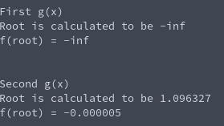

# Fixed Point Iteration
**Function Name**: ```fixed_point_iteration(double (*gfunction)(), double x0, double tolerance, int max_iterations)```:

**Header File**: fixed_point_iteration.c

**Author**: Ethan Ancell

**Language**: C. This code can be compiled with the GNU C compiler (gcc).

**Description/Purpose**: This code will calculate the root for a function used the fixed point iterative scheme. A transformed function is required that will evaluate to the root itself if the root is plugged into the function. This "converted" function is required for fixed point iteration to work.

**Input**:
* double (\*gfunction)() - A function pointer to the "converted" function used to find the root of the original function.
* double x0 - An initial guess to the root of the function.
* double tolerance - How close to the root of the function our final answer returned by the fixed point iteration method should be.
* int max_iterations - The maximum number of iterations that we should try to go through while doing fixed point iteration.

**Output**: Returns a double with the guess of the root of the function.

**Usage Example**: Here the usage of fixed point iteration for two different iterative schemes will be demonstrated. The converted functions will all be based upon the original function we wish to find the root of.

Original function:
```
f(x) = xcosh(x) + x^3 - pi
```
To transform the functions to be usable in a fixed point iterative scheme, the following g(x) functions were created:
```
g1(x) = x + f(x)
g1(x) = x + xcosh(x) + x^3 - pi

g2(x) = x - (1/8)f(x)
g2(x) = x - (1/8)(xcosh(x) + x^3 - pi)
```
Code was written to set up and evaluate the root of f(x) based upon the above g(x) schemes. The link to that code can be found [here.](https://github.com/ethanancell/math4610/blob/master/tasks_source/task_sheet_2/sheet2task3/task3.c)

The output from the example in the console is as follows:



As it turns out, g1(x) isn't a very good function to use because we return a nonsensical answer. g2(x) seems to be a better choice of a function to use because it gives a more sensible answer.

**Code**: Link to the fixed point iteration code can be found [here](https://github.com/ethanancell/math4610/blob/master/shared_library/src/fixed_point_iteration.c)
