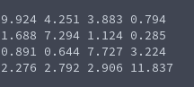

# Generation of Diagonally Dominant Matrix
**Function Prototype**: ```void gen_mtxdd(int n, double* a, double l, double u)```

**Header File**: gen_mtxdd.h

**Author**: Ethan Ancell

**Language**: C. This code can be compiled with the GNU C compiler (gcc).

**Description/Purpose**: This function will generate a square matrix that
has the property of diagonal dominance. The methodology employed in this
implementation is to generate all of the non-diagonal entries, and then compute
the diagonal entries by summing all of the other columns in the same row
and then adding on an additional random number between the lower and upper
bound given in the function parameters.

**Input**:
* ```int n``` - The dimension of the linear system.
* ```double* a``` - A pointer to the matrix A.
* ```double l``` - The lower bound for random number generation.
* ```double u``` - The upper bound for random number generation.

**Output**: No direct return value, but the matrix generated is stored inside of the location pointed to by "a".

**Usage Example**: Example code [here.](../software/matrix/generation/gen_mtxdd_example.c/)



**Code**: Link to the source code is found [here.](../shared_library/src/gen_mtxdd.c)
