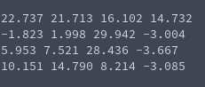

# Generation of Square Matrix
**Function Prototype**: ```void gen_mtxsquare(int n, double* a, double lower_bound, double upper_bound)```

**Header File**: gen_mtxsquare.h

**Author**: Ethan Ancell

**Language**: C. This code can be compiled with the GNU C compiler (gcc).

**Description/Purpose**: This function will generate a square matrix with uniformly distributed random doubles between the bounds given in the function parameters.

**Input**:
* ```int n``` - The dimension of the linear system.
* ```double* a``` - A pointer to the matrix A.
* ```double lower_bound``` - The lower bound for random numbers inside the matrix.
* ```double upper_bound``` - The upper bound for random numbers inside the matrix.

**Output**: No direct return value, but the matrix generated is stored inside of the location pointed to by "a".

**Usage Example**: Example code [here.](../software/matrix/generation/gen_mtxsquare_example.c/) In this case, we have all the entries to be between -5.5 and 35. The result is the following:



**Code**: Link to the source code is found [here.](../shared_library/src/gen_mtxsquare.c)
