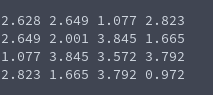

# Generation of Symmetric Matrix
**Function Prototype**: ```void gen_mtxsym(int n, double* a, double l, double u)```

**Header File**: gen_mtxsym.h

**Author**: Ethan Ancell

**Language**: C. This code can be compiled with the GNU C compiler (gcc).

**Description/Purpose**: This function will generate a square matrix that
is symmetric using the lower and upper bounds given in the function
parameters for the random number generation.

**Input**:
* ```int n``` - The dimension of the linear system.
* ```double* a``` - A pointer to the matrix A.
* ```double l``` - The lower bound for random number generation.
* ```double u``` - The upper bound for random number generation.

**Output**: No direct return value, but the matrix generated is stored inside of the location pointed to by "a".

**Usage Example**: Example code [here.](../software/matrix/generation/gen_mtxsym_example.c/)



**Code**: Link to the source code is found [here.](../shared_library/src/gen_mtxsym.c)
