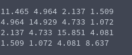

# Generation of Symmetric and Diagonally Dominant Matrix
**Function Prototype**: ```void gen_mtxsymdd(int n, double* a, double l, double u)```

**Header File**: gen_mtxsymdd.h

**Author**: Ethan Ancell

**Language**: C. This code can be compiled with the GNU C compiler (gcc).

**Description/Purpose**: This function will generate a square matrix that
has both the property of diagonal dominance and symmetry. This will use the
lower and upper bounds given in the function parameters as part of the
random number generation.

**Input**:
* ```int n``` - The dimension of the linear system.
* ```double* a``` - A pointer to the matrix A.
* ```double l``` - The lower bound for random number generation.
* ```double u``` - The upper bound for random number generation.

**Output**: No direct return value, but the matrix generated is stored inside of the location pointed to by "a".

**Usage Example**: Example code [here.](../software/matrix/generation/gen_mtxsymdd_example.c/)



**Code**: Link to the source code is found [here.](../shared_library/src/gen_mtxsymdd.c)
