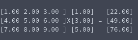

# Matrix and Vector multiplication
**Function Prototype**: ```void mtx_vec_multiply (int m, int n, double A[m][n], double x[], double* destination);```

**Header File**: mtx_vec_multiply.h

**Author**: Ethan Ancell

**Language**: C. This code can be compiled with the GNU C compiler (gcc).

**Description/Purpose**: This function will take a matrix A and do standard matrix and vector multiplication with the vector x, and then store the resulting vector into the double pointer marked by "destination".

**Input**:
* int m - The rows in the matrix
* int n - The columns in the matrix and rows in the vector
* double A[][] - The matrix that we are using multiplication with. Must specify the size of the matrix dimensions inside of the square brackets.
* double x[] - The vector that we are multiplying A by.
* double* destination - The pointer where we are storing the result in.

**Output**: No direct output, but the result from the multiplication is stored inside of the pointer "destination" that is specified inside the function parameters.

**Usage Example**: Example code using the matrix multiplication can be found [here.](https://github.com/ethanancell/math4610/blob/master/software/matrix/matrix_multiply.c)

The output from the console is the following:



**Code**: Link to the source code for vector operations is [here.](https://github.com/ethanancell/math4610/blob/master/shared_library/src/mtx_vec_multiply.c)
