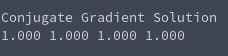

# Linear System Solving (Conjugate Gradient Method)
**Function Prototype**: ```void mtx_cgsolve(int n, double* a, double* b, double* x, double tolerance);```

**Header File**: mtx_cgsolve.h

**Author**: Ethan Ancell

**Language**: C. This code can be compiled with the GNU C compiler (gcc).

**Description/Purpose**: This function will take a square matrix and use the conjugate gradient method to obtain a solution to the system in the location pointed to by x, using a sensitivity of "tolerance" inside the inner calculations.

**Input**:
* ```int n``` - The rows and columns of the matrix and solution vectors.
* ```double* a``` - A pointer to the array that contains the matrix.
* ```double* b``` - A pointer to the b vector.
* ```double* x``` - A pointer to where the solution will be stored.
* ```double tolerance``` - A measure of sensitivity between successive guesses towards the solution of the system of equations.

**Output**: The result from performing the solving will be stored in the memory location pointed to by x.

**Usage Example**: [This code](../software/matrix/mtx_cgsolve_example.c) will
create a symmetric and diagonally dominant matrix, and will multiply that matrix into a
vector of ones for the b vector, and then after solving the system of equations
we hope to see a vector of ones as the solution vector.

The resulting output is the following:



**Code**: Link to the source code for the library code is
stored [here.](../shared_library/src/mtx_cgsolve.c)
