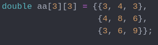
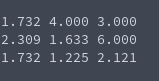

# Cholesky Factorization (of symmetric matrix)
**Function Prototype**: ```int mtx_choleskyfact(int n, double* a)```

**Header File**: mtx_choleskyfact.h

**Author**: Ethan Ancell

**Language**: C. This code can be compiled with the GNU C compiler (gcc).

**Description/Purpose**: This function will first check to see that the matrix
given is a symmetric matrix, and then compute a Cholesky factorization.
Next, it will take the pointer to the matrix
and change it so that the lower part of the matrix contains an "L", and
can be assumed the "L transpose" is simply the the transpose of the lower
triangular part of the matrix.

**Input**:
* ```int n``` - The dimension of the square matrix A.
* ```double* a``` - A pointer to the matrix A.

**Output**: Returns "-1" if the matrix is not a symmetric matrix and the check
in the code has caught it. Will return "0" if the matrix is a symmetric matrix
and the Cholesky factorization has completed.

**Usage Example**: Example code [here.](../software/matrix/mtx_choleskyfact_example.c)
We assign an example matrix in the following way:



After the factorization is completed, we get the following result:



**Code**: Link to the source code is found [here.](../shared_library/src/mtx_choleskyfact.c)
