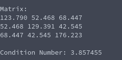

# Condition Number of Matrix
**Function Prototype**: ```double mtx_conditionnumber(int n, double* a, double tolerance, int max_iterations);```

**Header File**: mtx_conditionnumber.h

**Author**: Ethan Ancell

**Language**: C. This code can be compiled with the GNU C compiler (gcc).

**Description/Purpose**: This function will return the condition number of a matrix. It is often used as a measure of closeness to a singular matrix.

**Input**:
* ```int n``` - The size of the square matrix.
* ```double* a``` - A pointer to the matrix that we will find the condition number of.
* ```double tolerance``` - How close the successive guesses to the eigenvalues will be when the termination condition for the iterative method is reached. The approximations of eigenvalues is an internal computation involved when finding the condition number.
* ```int max_iterations``` - A maximum number of times that the iterative method should loop through.

**Output**: Returns a double value that contains the approximation to the condition number of the matrix.

**Usage Example**: [This code](../software/eigen/mtx_conditionnumber_example.c) is an example of code that will run the condition number of a randomly generated matrix that is symmetric and diagonally dominant.

The output from when I ran the code is the following:



**Code**: Link to the source code of the condition number can be found [here.](../shared_library/src/mtx_conditionnumber.c)
