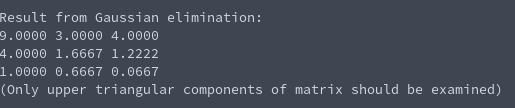

# Gaussian Elimination
**Function Prototype**: ```void mtx_echelon(int n, double* a, double* b);```

**Header File**: mtx_echelon.h

**Author**: Ethan Ancell

**Language**: C. This code can be compiled with the GNU C compiler (gcc).

**Description/Purpose**: This function will take a square matrix and reduce it
down to reduced row echelon form.

**Input**:
* ```int n``` - The rows and columns of the matrix and solution vectors.
* ```double* a``` - A pointer to the array that contains the matrix.
* ```double* b``` - A pointer to the b vector.

**Output**: The matrix that is stored inside of the matrix pointer will be
changed to the reduced row matrix. Keep in mind that no zeros are filled into
the reduced sections of the matrix, so the output should be examined solely
on the upper triangular part of the output.

**Usage Example**: [This code](../software/matrix/mtx_echelon_example.c) will
create a matrix and reduce the row using Gaussian elimination. The result from
the console after running the code is the following:



**Code**: Link to the source code for Gaussian elimination is
stored [here.](../shared_library/src/mtx_echelon.c)
