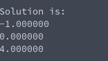

# Linear System Solving (Row reduction, then upper system solve)
**Function Prototype**: ```void mtx_echelonsolve(int n, double* a, double* b, double* x);```

**Header File**: mtx_echelonsolve.h

**Author**: Ethan Ancell

**Language**: C. This code can be compiled with the GNU C compiler (gcc).

**Description/Purpose**: This function will take a square matrix and reduce it down to reduced row form, and then use that reduced form in
an upper system solve to get a solution of x.

**Input**:
* ```int n``` - The rows and columns of the matrix and solution vectors.
* ```double* a``` - A pointer to the array that contains the matrix.
* ```double* b``` - A pointer to the b vector.
* ```double* x``` - A pointer to where the solution will be stored.

**Output**: The matrix that is stored inside of the matrix pointer will be
changed to the reduced row matrix, and the b vector will be changed
according to the reduction in a. Afterwards, the solution to the linear
system will be stored inside of x.

**Usage Example**: [This code](../software/matrix/mtx_echelon2_example.c) will
create a matrix and reduce the row using Gaussian elimination, and
then use that result to compute the solution to the upper
triangular system. The console after running the code is the following:


**Code**: Link to the source code for the library code is
stored [here.](../shared_library/src/mtx_echelonsolve.c)
