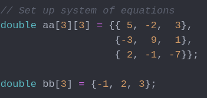
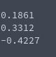

# Gauss-Seidel Iteration (Linear System Solving)
**Function Prototype**: ```int mtx_gssolve(int n, double* a, double* b, double* x, double tolerance, int max_iterations)```

**Header File**: mtx_gssolve.h

**Author**: Ethan Ancell

**Language**: C. This code can be compiled with the GNU C compiler (gcc).

**Description/Purpose**: This function will iteratively solve a linear system of equations by using the Gauss-Seidel method. This is an optimization of the Jacobi iteration.

**Input**:
* ```int n``` - The dimension of the linear system.
* ```double* a``` - A pointer to the matrix A.
* ```double* b``` - A pointer to the right hand side vector "b".
* ```double* x``` - A pointer to the solution vector "x". Must contain an initial guess.
* ```double tolerance``` - A tolerance between the error between successive
iterations. The error is computed with the 2-norm.
* ```int max_iterations``` - The maximum amount of iterations that the
function should take.

**Output**: Returns the number of iterations that the code took to reach the exit completions.

**Usage Example**: Example code [here.](../software/matrix/mtx_gssolve_example.c) We assign the linear system in the following
way:



After the solving is complete, we get the following result for x:



**Code**: Link to the source code is found [here.](../shared_library/src/mtx_gssolve.c)
