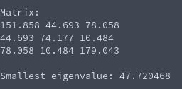

# Inverse Power Method (Eigenvalues of Matrix)
**Function Prototype**: ```double mtx_inversepowermethod(int n, double* a, double* v, double tolerance, int max_iterations);```

**Header File**: mtx_inversepowermethod.h

**Author**: Ethan Ancell

**Language**: C. This code can be compiled with the GNU C compiler (gcc).

**Description/Purpose**: This function will return the smallest eigenvalue of a matrix.

**Input**:
* ```int n``` - The size of the square matrix.
* ```double* a``` - A pointer to the matrix that we will find the smallest eigenvalue of.
* ```double* v``` - An initial guess for the corresponding eigenvector.
* ```double tolerance``` - How close the successive guesses to the eigenvalue will be when the termination condition for the iterative method is reached.
* ```int max_iterations``` - A maximum number of times that the iterative method should loop through.

**Output**: Returns a double value that contains the smallest eigenvalue to the square matrix.

**Usage Example**: [This code](../software/eigen/mtx_inversepowermethod_example.c) is an example of code that will run the power method for finding the smallest eigenvalue of a square matrix.

The code will randomly generate a symmetric and diagonally dominant matrix for the square matrix with off-diagonal entries that are in between 0 and 100. An example console output is the following:



**Code**: Link to the source code of inverse power iteration can be found [here.](../shared_library/src/mtx_inversepowermethod.c)
