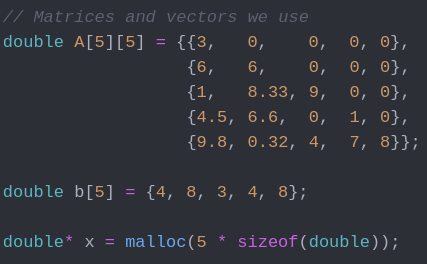
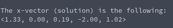

# Linear System Solving (Featuring Lower Triangular Matrix)
**Function Prototype**: ```void mtx_lowersolve(int m, double A[m][m], double b[m], double* x)```

**Header File**: mtx_lowersolve.h

**Author**: Ethan Ancell

**Language**: C. This code can be compiled with the GNU C compiler (gcc).

**Description/Purpose**: This function will solve a linear system where all of the coefficients for the
linear system can be represented in a square matrix where all the entries lie in
a lower triangular fashion.

**Input**:
* ```int m``` - The dimension of the square matrix. Columns and rows should be the same.
* ```double A[m][n]``` - The diagonal matrix that contains the coefficients for the linear system.
* ```double b[m]``` - The vector that contains the result of the matrix vector multiplication.
* ```double* x``` - A pointer to where the resulting vector will be stored. Assumes that
the location in memory has already been allocated.

**Output**: The resulting vector as a solution will be stored in the pointer that
is part of the input to the function.

**Usage Example**: For this multiplication, we will assign an example matrix and "b" in the following way:



The resulting x-vector that we solve for is the following as given in the console output:



The link to the code that uses all of this is located [here](../software/matrix/mtx_lowersolve_example.c)

**Code**: Link to the source code for diagonal matrix solving is [here.](../shared_library/src/mtx_lowersolve.c)
