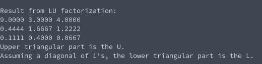

# LU-factorization
**Function Prototype**: ```void mtx_lufact(int n, double* a);```

**Header File**: mtx_lufact.h

**Author**: Ethan Ancell

**Language**: C. This code can be compiled with the GNU C compiler (gcc).

**Description/Purpose**: This function will take a square matrix and create
the factorization LU, that when L and U multiplied together will achieve
the original matrix A.

**Input**:
* ```int n``` - The rows and column length of the matrix.
* ```double* a``` - A pointer to the array that contains the matrix.

**Output**: The matrix that is stored inside of the matrix pointer will be
changed to the LU-factorization. The upper triangular part of "a" will be
changed to the "U" in the factorization. The "L" part of the factorization
will use the space of the lower part of "a", and assumes a diagonal of 1's.

**Usage Example**: [This code](../software/matrix/mtx_lufact_example.c) will
create a matrix and then do the LU-factorization. The output from the
console from the example is the following:



**Code**: Link to the source code for LU-factorization is
stored [here.](../shared_library/src/mtx_lufact.c)
