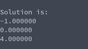

# Linear System Solving (Lu-factorization, then solve)
**Function Prototype**: ```void mtx_lufactsolve(int n, double* a, double* b, double* x);```

**Header File**: mtx_lufactsolve.h

**Author**: Ethan Ancell

**Language**: C. This code can be compiled with the GNU C compiler (gcc).

**Description/Purpose**: This function will take a square matrix, perform a LU-factorization, and then use that form in a forward and backward
substitution process to find the solution for x.

**Input**:
* ```int n``` - The rows and columns of the matrix and solution vectors.
* ```double* a``` - A pointer to the array that contains the matrix.
* ```double* b``` - A pointer to the b vector.
* ```double* x``` - A pointer to where the solution will be stored.

**Output**: The matrix that is stored inside of the matrix pointer will be
changed to the LU-factorization, afterwards, the solution to the linear
system will be stored inside of x.

**Usage Example**: [This code](../software/matrix/mtx_lufactsolve_example.c) will
create a matrix and factorize it to an L and U, and
then use that result to compute the solution to the system. The console after running the code is the following:


**Code**: Link to the source code for the library code is
stored [here.](../shared_library/src/mtx_lufactsolve.c)
