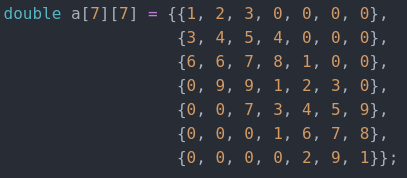
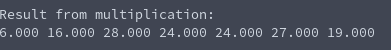

# Pentadiagonal Matrix-Vector Multiplication
**Function Prototype**: ```void mtx_pentadiagonal_multiply(int n, double* auu, double* au, double* ad, double* al, double* all, double* x, double* y)```

**Header File**: mtx_pentadiagonal_multiply.h

**Author**: Ethan Ancell

**Language**: C. This code can be compiled with the GNU C compiler (gcc).

**Description/Purpose**: If the matrix in a matrix vector multiplication happens to be "pentadiagonal", then this function will reduce the multiplication time that is required in a typical matrix calculation by ignoring all of the zeros that are known to be inside of the matrix.

**Input**:
* ```int n``` - The dimension or size of the square matrix and vectors.
* ```double* auu``` - A vector that contains the upper upper diagonal of the matrix.
* ```double* au``` - A vector that contains the upper diagonal of the matrix.
* ```double* ad``` - A vector that contains the diagonal of the matrix.
* ```double* al``` - A vector that contains the lower diagonal of the matrix.
* ```double* all``` - A vector that contains the lower lower diagonal of the matrix.
* ```double* x``` - The vector that the matrix is being multiplied by.
* ```double* y``` - The location where the result of the multiplication will be stored.

**Output**: This will store the result of the multiplication operation inside of the vector that is pointed to by "y".

**Usage Example**: The code for this example is found [here.](../software/matrix/pentadiagonal.c) The following matrix is created:



The matrix is then converted into the vectors that will go inside of the operation itself. It is then multiplied into a vector of ones, and the result from the operation is the following:



**Code**: Link to the source code for this operation can be found [here.](../shared_library/src/mtx_pentadiagonal_multiply.c)
