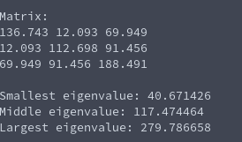

# Power Method with Shifting (Eigenvalues of Matrix)
**Function Prototype**: ```double mtx_shiftpowermethod(int n, double* a, double* v, double alpha, double tolerance, int max_iterations);```

**Header File**: mtx_shiftpowermethod.h

**Author**: Ethan Ancell

**Language**: C. This code can be compiled with the GNU C compiler (gcc).

**Description/Purpose**: This function will attempt to return an eigenvalue of the system. The convergence to a solution is dependent upon how good the initial guess "alpha" is chosen, as well as the accompanying eigenvector to the eigenvalue we are trying to find. This method is useful for finding "middle" eigenvalues that the power method and inverse power method can not find.

**Input**:
* ```int n``` - The size of the square matrix.
* ```double* a``` - A pointer to the matrix that we will find the smallest eigenvalue of.
* ```double* v``` - An initial guess for the corresponding eigenvector.
* ```double alpha``` - An initial guess for the eigenvalue that we are trying to converge to.
* ```double tolerance``` - How close the successive guesses to the eigenvalue will be when the termination condition for the iterative method is reached.
* ```int max_iterations``` - A maximum number of times that the iterative method should loop through.

**Output**: Returns a double value that contains the attempted convergence to an eigenvalue of the matrix.

**Usage Example**: [This code](../software/eigen/mtx_shiftpowermethod_example.c) is an example of code that will run the shifted power method for finding the middle eigenvalue of a 3x3 matrix that is symmetric and diagonally dominant, using the midway point between the smallest and largest eigenvalues as an initial guess.



**Code**: Link to the source code of shifted power iteration can be found [here.](../shared_library/src/mtx_shiftpowermethod.c)
