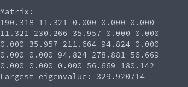

# Tridiagonal Power Method (Eigenvalues of Matrix)
**Function Prototype**: ```double mtx_tridiag_powermethod(int n, double* au, double* ad, double* al, double* v, double tolerance, int max_iterations);```

**Header File**: mtx_tridiag_powermethod.h

**Author**: Ethan Ancell

**Language**: C. This code can be compiled with the GNU C compiler (gcc).

**Description/Purpose**: This function will return the largest eigenvalue of a tridiagonal matrix.

**Input**:
* ```int n``` - The size of the square matrix.
* ```double* au``` - A pointer to the upper diagonal of the matrix.
* ```double* ad``` - A pointer to the main diagonal of the matrix.
* ```double* al``` - A pointer to the lower diagonal of the matrix.
* ```double* v``` - An initial guess for the corresponding eigenvector.
* ```double tolerance``` - How close the successive guesses to the eigenvalue will be when the termination condition for the iterative method is reached.
* ```int max_iterations``` - A maximum number of times that the iterative method should loop through.

**Output**: Returns a double value that contains the largest eigenvalue to the matrix.

**Usage Example**: [This code](../software/eigen/mtx_tridiag_powermethod_example.c) is an example of code that will run the power method for finding the largest eigenvalue of a square matrix.

The code will randomly generate a symmetric and diagonally dominant tridiagonal matrix with off-diagonal entries that are in between 0 and 100. An example console output is the following:



**Code**: Link to the source code of power iteration can be found [here.](../shared_library/src/mtx_tridiag_powermethod.c)
