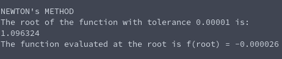

# Function Title
**Function Name**: ```newton(double (*function)(), double (*function_prime)(), double x0, double tolerance, int max_iterations)```

**Header File**: newton.h

**Author**: Ethan Ancell

**Language**: C. This code can be compiled with the GNU C compiler (gcc).

**Description/Purpose**: This function will calculate the root for a function using Newton's method. We require a function, the function's derivative, and an initial guess. Newton's method will use the derivative of the function to zoom in close to the root and find a good approximation.

**Input**:
* double (\*function)() - A function pointer to the function that we wish to find the root of.
* double (\*function_prime)() - The derivative of the funcion that we wish to find the root of.
* double x0 - An initial guess for where the root might be. Must be sufficiently close for Newton's method to converge to the root.
* double tolerance - How close within the real root we should be after looping through Newton's method.
* int max_iterations - The maximum amount of times we should loop through Newton's method before we exit. This is placed so that our code does not accidentally create some infinite loop when in reality the conditions for Newton's method aren't sufficiently met.

**Output**: Returns a double with the guess of the root of the function.

**Usage Example**: Here we demonstrate Newton's method on the following function:
```
f(x) = xcosh(x) + x^3 - pi
```
Recall that we need the function's derivative to find the root:
```
f'(x) = cosh(x) - xsinh(x) + 3x^2
```
The example code to utilize Newton's method on this function with a tolerance of 0.00001 and maximum iterations of 1000 can be found [here.](https://github.com/ethanancell/math4610/blob/master/shared_library/function_examples/newton_root.c)

The output from the code that uses Newton's method is:



**Code**: Link to Newton's method code can be found [here](https://github.com/ethanancell/math4610/blob/master/shared_library/src/newton.c)
