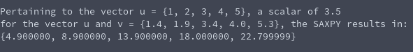

# SAXPY
**Function Name**: ```void saxpy(float scalar, float* u, float* v, int length)```

**Header File**: saxpy.h

**Author**: Ethan Ancell

**Language**: C. This code can be compiled with the GNU C compiler (gcc).

**Description/Purpose**: This function will take a vector v, and add the vector u times the scalar, and specifically in the context of single precision numbers.

**Input**:
* float scalar - the amount we scale u by.
* float u* - a pointer to the vector we scale to add to v
* float v* - a pointer to the vector we add the scaled u to.

**Output**: No explicit return amount, but because v[] is passed into the function in the form of a pointer, the function has direct access to the variable and it will be changed within the function itself.

**Usage Example**: Example code using SAXPY is [here.](https://github.com/ethanancell/math4610/blob/master/software/vectors/saxpy_demo.c)

The output from the console is the following:



**Code**: Link to the source code for SAXPY is [here.](https://github.com/ethanancell/math4610/blob/master/shared_library/src/saxpy.c)
