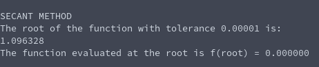

# Secant Method (Root finding)
**Function Name**: ```secant(double (*function)(), double x0, double x1, double tolerance, int max_iterations)```

**Header File**: secant.h

**Author**: Ethan Ancell

**Language**: C. This code can be compiled with the GNU C compiler (gcc).

**Description/Purpose**: This function will calculate the root for a function using the secant method. We require a function and two initial guesses. The secant method will use an approximation of the derivative to create a resemblance of Newton's method when we do not know the derivative of our function.

**Input**:
* double (\*function)() - A function pointer to the function that we wish to find the root of.
* double x0 - An initial guess for where the root might be. Must be sufficiently close to converge to the root.
* double x1 - Another initial guess that we use to approximate the derivative of the function.
* double tolerance - How close within the real root we should be after looping through the secant method.
* int max_iterations - The maximum amount of times we should loop through before we exit. This is placed so that our code does not accidentally create some infinite loop when in reality the conditions aren't sufficiently met.

**Output**: Returns a double with the guess of the root of the function.

**Usage Example**: Here we demonstrate the secant method on the following function:
```
f(x) = xcosh(x) + x^3 - pi
```

The example code to utilize the secant method on this function with a tolerance of 0.00001 and maximum iterations of 1000 can be found [here.](https://github.com/ethanancell/math4610/blob/master/shared_library/function_examples/secant_root.c) We use the initial guesses of 1.0 and 1.05.

The output from the code that uses the secant method is the following:



**Code**: Link to secant method code can be found [here](https://github.com/ethanancell/math4610/blob/master/shared_library/src/secant.c)
