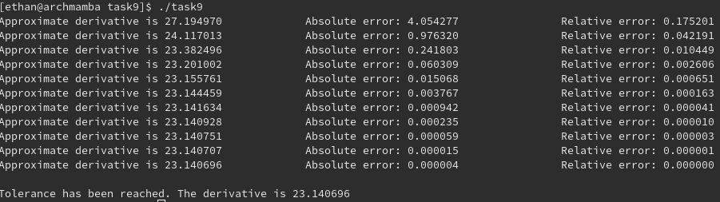

# Software Manual

## Absolute Error
**Function Name**: absolute\_error

**Author**: Ethan Ancell

**Language**: C. This code can be compiled with the GNU C compiler (gcc).

**Description/Purpose**: This function will calculate the absolute error between the precise number and the approximation to that number.

**Input**: Two double numbers are inputted, one called "true\_value" and one called "approximation".

**Output**: This function will return the absolute difference between the true value of the number and the approximation to that number.

**Usage Example**: An example below is given with the absolute error of the true value of 4.5 and its approximation of 4.643. 
```
printf("The absolute error of 4.5 and 4.643 is %f\n", absolute_error(4.5, 4.643));
```
After including this line somewhere in a program, the output from that line will be the following:
```
The absolute error of 4.5 and 4.643 is 0.143000
```

**Code**: The source for this code can be found [here.](../shared_library/src/absolute_error.c)

## Relative Error
**Function Name**: relative\_error

**Author**: Ethan Ancell

**Language**: C. This code can be compiled with the GNU C compiler (gcc).

**Description/Purpose**: This function will calculate the relative error between the precise number and the approximation to that number.

**Input**: Two double numbers are inputted, one called "true\_value" and one called "approximation". We must be careful to not use a value of zero for the true\_value, since the relative error is undefined for that value.

**Output**: This function will return the relative difference between the true value of the number and the approximation to that number in the form of a proportion in terms to the true value.

**Usage Example**: An example below is given with the absolute error of the true value of 4.5 and its approximation of 4.643. 
```
printf("The relative error of 4.5 and 4.643 is %f\n", relative_error(4.5, 4.643));
```
After including this line somewhere in a program, the output from that line will be the following:
```
The relative error of 4.5 and 4.643 is 0.031778
```

**Code**: A link to the code can be found [Here](../shared_library/src/relative_error.c)

## Approximation of Derivative Using Difference Quotient (Task Sheet 1 - Task 6)
[Link to code](../tasks_source/task_sheet_1/task_6/task6.c)

In this code, I used an arbitrary example function of the sine function to calculate derivatives, with an also arbitrary value of 2 to plug in.
This program will not be part of the shared library since it is demonstrating a concept, and for that reason there is a "driver" functionality that is occuring with the main function.

The "example\_function" function is the one that will return the value of the sine function.

The "calculate\_derivative" function is the one that will simply return the value of the central difference that was given in the task sheet.

Inside the main function, we set an initial value of h to be 1. Afterwards, we loop 100 times (just for good measure to get h very small) and calculate the derivative using that small h-value.

As expected, the output gets closer and closer to the real value of the derivative of sine evaluated at 2. (We can check using cosine of 2) Eventually, the approximate derivate starts getting bigger and then eventually goes to a nonsensical answer, where h has surpassed our machine precision limit and we no longer can represent h accurately, which in turn gives the nonsensical answers.

A screenshot of the machine output has been included below.


As we can see, around the first few iterations, the approximation to the derivative is off by quite a bit. The approximation becomes best around 20 iterations, and then slowly starts to diverge away until eventually becoming unusable around the 53rd iteration. The 21st iteration is where the machine precision starts to affect the output after using the h value in the calculations, and the 53rd iteration is where the h completely disappears out of view due to becoming too small for the double type.

## Derivative of Exponential Function at pi (Task Sheet 1 - Task 9)
[Link to code](../tasks_source/task_sheet_1/task_9/)

The link above directs to the folder where all of the relevant work for this problem resides. A copy of the shared library has been made in the directly along with the needed header files for the library to work correctly.

In this program, we incrementally make h smaller and smaller for the approximation of the derivative using the central difference technique. We set the error to be the absolute error (using the shared library) of that number and the true value of the derivative of the exponential function at pi. The relative error is also computed, but only used for printing rather than affecting decision flow in the program itself.

Once the tolerance is reached, then the while loop exits and we print out the approximation.

A screenshot of the program is included below:



## A Write-up on Absolute and Relative Errors
The main consensus that I gathered from whether you should be using the absolute or relative error is that it entirely depends upon the context of your problem. The absolute error is useful for being precise in your distance from what you want to reach, but it has drawbacks in that we can't tell if the error is significant, because that depends on how large the correct value is. A relative error is generally more useful because you can get within a "percentage" of the true value, which is a lot more generalizable to any size of number you wish to approximate.

My sources for these sentences comes from the site https://ece.uwaterloo.ca/~dwharder/NumericalAnalysis/01Error/Error/
