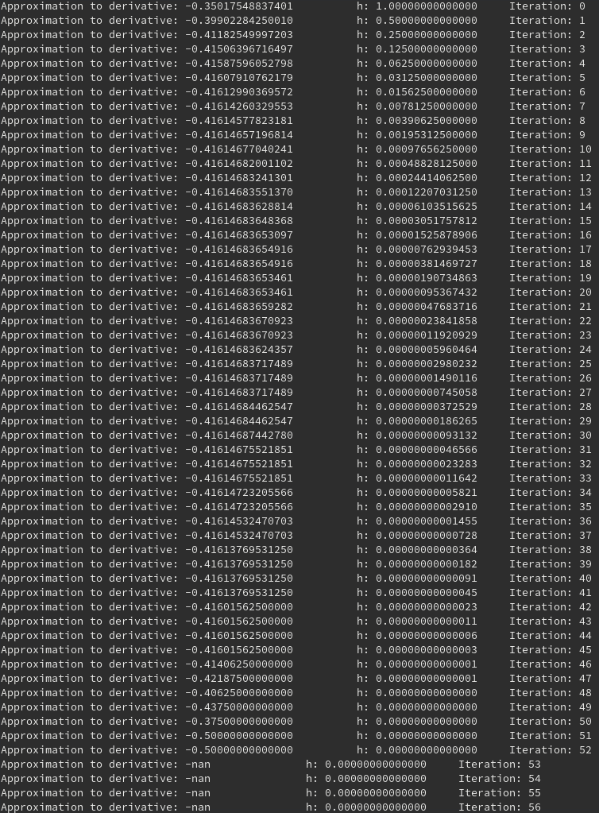

# Software Manual

## Task Sheet 1

### Task 6
[Link to task 6 code](../tasks_source/task_sheet_1/task_6/task6.c)

In this code, I used an arbitrary example function of the sine function to calculate derivatives, with an also arbitrary value of 2 to plug in.
This program will not be part of the shared library since it is demonstrating a concept, and for that reason there is a "driver" functionality that is occuring with the main function.

The "example\_function" function is the one that will return the value of the sine function.

The "calculate\_derivative" function is the one that will simply return the value of the central difference that was given in the task sheet.

Inside the main function, we set an initial value of h to be 1. Afterwards, we loop 100 times (just for good measure to get h very small) and calculate the derivative using that small h-value.

As expected, the output gets closer and closer to the real value of the derivative of sine evaluated at 2. (We can check using cosine of 2) Eventually, the approximate derivate starts getting bigger and then eventually goes to a nonsensical answer, where h has surpassed our machine precision limit and we no longer can represent h accurately, which in turn gives the nonsensical answers.

A screenshot of the machine output has been included below.

