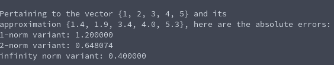

# Vector Absolute Error (2-Norm)
**Function Name**: ```vec_absolute_error_2(double x_approx[], double x[], size_t length)```

**Header File**: vec_error.h

**Author**: Ethan Ancell

**Language**: C. This code can be compiled with the GNU C compiler (gcc).

**Description/Purpose**: This function computes the absolute error for a vector using the 2-norm calculation for the magnitude.

**Input**:
* double x_approx[] - the approximation to x[]
* double x[] - the vector that we are approximating
* size_t length - An integer length for the length of the vectors.

**Output**: Returns a double with the absolute error between the vectors as a magnitude.

**Usage Example**: Example code using the absolute errors can be found [here.](https://github.com/ethanancell/math4610/blob/master/software/vectors/absolute_error.c)

The output from the console is the following:



**Code**: Link to the source code for vector errors is [here.](https://github.com/ethanancell/math4610/blob/master/shared_library/src/vec_error.c)
