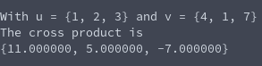

# Vector Cross Product
**Function Name**: ```double* vec_crossproduct(double u[], double v[])```

**Header File**: vec_product.h

**Author**: Ethan Ancell

**Language**: C. This code can be compiled with the GNU C compiler (gcc).

**Description/Purpose**: This function will return the cross product of two vectors.
The mathematical purpose and usage behind a cross product is not covered in this software manual.
This code will assume that the two vectors are of length three, because typically cross
products are applied to vectors of three dimensions.

**Input**:
* double u[] - the first vector
* double v[] - the second vector

**Output**: Returns a pointer to the double array that contains the cross product of the two inputted vectors.
The pointer is dynamically allocated inside of the implementation for the cross product, so make sure to
free the memory when completed.

**Usage Example**: Example code using the cross product can be found [here.](https://github.com/ethanancell/math4610/blob/master/software/vectors/crossproduct.c)

The output from the console is the following:



**Code**: Link to the source code for vector products is [here.](https://github.com/ethanancell/math4610/blob/master/shared_library/src/vec_product.c)
