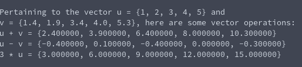

# Vector Scaling
**Function Name**: ```double* vec_scale(double scalar, double u[], size_t length)```

**Header File**: vec_scale.h

**Author**: Ethan Ancell

**Language**: C. This code can be compiled with the GNU C compiler (gcc).

**Description/Purpose**: This function will take a scalar and multiply it through the vector u and return a pointer to the result.

**Input**:
* double scalar - the amount to scale by
* double u[] - the first vector

**Output**: Returns a pointer to the vector that is created from the scalar operation. Make sure to free the memory in the pointer at the end of your program.

**Usage Example**: Example code using the vector operations can be found [here.](https://github.com/ethanancell/math4610/blob/master/software/vectors/operations.c)

The output from the console is the following:



**Code**: Link to the source code for vector operations is [here.](https://github.com/ethanancell/math4610/blob/master/shared_library/src/vec_scale.c)
