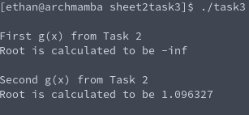

# Tasksheet 2 - Task 3

[Link to fixed point iteration code](https://github.com/ethanancell/math4610/blob/master/shared_library/src/fixed_point_iteration.c)

[Link to main program](https://github.com/ethanancell/math4610/blob/master/tasks_source/task_sheet_2/sheet2task3/task3.c)

A fixed point iteration code was written and then implemented into the shared library.

The main program (task3.c) utilized the shared library created from the fixed point iteration code to attempt to find a root. The main program had three functions, one for the original f(x), and two for the converted g(x) functions. Two attempts at finding the root were used, one for each g(x) function, and each with an initial guess of 0, a tolerance of 0.00001, and max iterations of 1000.

Here is the command line output of running the function:

As it appears, the root finding was unsuccessful for the first guess of g(x) due to the output of "-inf", but the second g(x) appears to be some sensible root that suggests that guess of g(x) may have worked.
