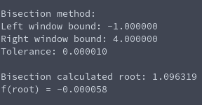

# Tasksheet 2 - Task 9

Here is the screenshot from the results of fixed point iteration:


Here is the screenshot from the results of the bisection method:



If we want to compare which method provides a better approximation with the same tolerance inputted, then a good measure would be to check what the function evaluates to at each of the roots.

**Bisection**:
```
f(1.096319)=-0.000058
```

**Fixed Point Iteration**:
```
f(1.096327)=-0.0000053
```

Because the function evaluated at the root given by fixed point iteration is smaller in magnitude, it is closer the function giving a value of zero (at true root), which means that the absolute error between fixed point iteration and the root is smaller than with the bisection method.

Because the bisection method cuts the interval down by half every single iteration, it doesn't have the same kind of rapid convergence that fixed point iteration can have when a proper g(x) function is chosen.

Although fixed point iteration has won the past two categories, where it fails is when it is hard to find a proper g(x) function. I tried out two different g(x) functions when I tested out fixed point iteration, and one of them gave a nonsensical answer because the iterations of the root started straying off towards negative infinity.

**Winning Methods**:
* Better approximation: Fixed point iteration
* Efficiency: Fixed point iteration
* Ease of implementation: Bisection method

[Link to fixed point iteration code](https://github.com/ethanancell/math4610/blob/master/shared_library/src/fixed_point_iteration.c)

[Link to bisection method code](https://github.com/ethanancell/math4610/blob/master/shared_library/src/bisection.c)
