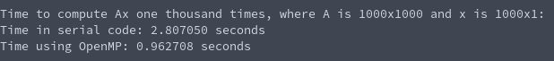
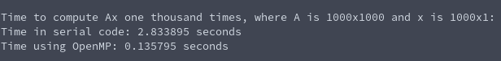

# Tasksheet 4 - Task 9

In order to see if I could speed up the matrix vector multiplication using OpenMP, I had to directly compare the performance of the two. In order to do that, I created a matrix A (size 1000 by 1000) with random digits, a random vector x with 1000 digits, and then timed the result of doing this multiplication one thousand times, because just one multiplication was too short of a time to directly compare.

The code used the native matrix and vector multiplication provided by the shared library using a serial method. The OpenMP variation was rewritten inside of the example code timing the two methods. The code that was used to test the performance between the two matrix vector codes can be found [here.](https://github.com/ethanancell/math4610/blob/master/software/matrix/matrix_multiply_openmp.c)

The result from the console is the following:

As a side note, when the executable is compiled with the -O3 flag, the compiler really figures out how to make a fast executable for the OpenMP variant, and the OpenMP variant of matrix vector multiplication has a speed increase of over TWENTY times!

As we can see, the OpenMP variant performed much quicker than the code that was written for only one processor.
