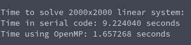

# Tasksheet 5 - Task 8

In order to see if I could speed up the LU factorization and solving with OpenMP, I had to directly compare the performance of the two. In order to do that, I created a linear system that was 2000x2000, and used the timing feature in OpenMP
to see how much faster the multi-core processing was.

The code used the native LU factorization solving provided by the shared library using a serial method. The OpenMP variation was rewritten inside of the example code timing the two methods. The code that was used to test the performance between the two matrix vector codes can be found [here.](https://github.com/ethanancell/math4610/blob/master/software/matrix/mtx_lufactsolve_openmp.c)

The result from the console is the following:

The executable was compiled with the -O3 flag, which
additionally gave a massive support to the multi-threaded
variant. The parallel code ran much, much faster compared
to the serially written code.
