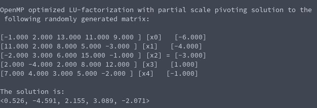

# Tasksheet 5 - Task 9

An LU-factorization code utilizing OpenMP and partial scale pivoting was
created. The main difference between this code and the code that is found
in Task 8 is that this one implemented a search for the largest pivot
relative to the maximum value in the row, and then did a "row swap" using an
index map that I chose to call "p". All references in the LU decomposition,
forward substitution, and back substitution used this index map.

The code for this function can be found [here.](https://github.com/ethanancell/math4610/blob/master/software/matrix/mtx_lufactsolve_openmp_psp.c)

A 5 by 5 matrix and b vector was randomly generated, and then the code that
was written was used. The driver code for the function contains printing of
the matrix and vectors involved, so we can see that the function worked
great.

The result from the console is the following:

We can see that this is indeed a solution to the linear system if we plug
it through a matrix and vector multiplication.
