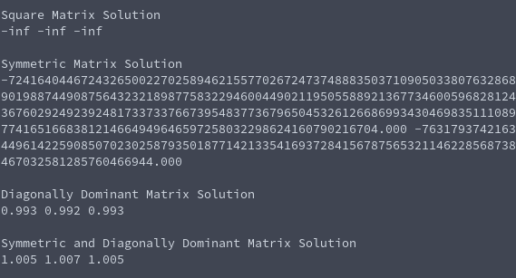

# Tasksheet 6 - Task 7

Code used in this task is found [here.](../../software/matrix/testjacobi.c)

In the testing code, four different matrices and solutions
were created using four different types of matrix
generation. The "b" vector was made by multiplying the
matrix generated into a vector of ones.

The output from the executable is the following:

Only the matrices that were diagonally dominant had a
seemingly convergent solution that is close to a vector of ones. For Jacobi iteration,
if the matrix is diagonally dominant, then a solution
will be guaranteed. In this particular random number
generation, the symmetric and uniformly generated
square matrices did not have a convergent solution with
the Jacobi iteration.
