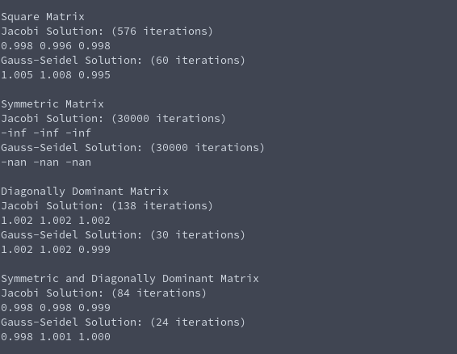

# Tasksheet 6 - Task 9

The code that runs all of this can be found [here.](../../software/matrix/test_jacobi_gs.c)

To compare the efficiency between Jacobi iteration and the Gauss-Seidel method,
an iteration tracker was planted inside of the implementation of the
Jacobi and Gauss-Seidel iteration in the shared library code and was returned
as an integer through the method.

Because the numbers inside of the matrix are randomly generated, we can
expect a different answer every time we run the code, but an example
console output from the code is the following:

In this case, we have a convergent solution for all except the symmetric
matrix. We are guaranteed a solution for the diagonally dominant matrices,
but we happened to be lucky for the square matrix. In my other testing of the
code, it was rare to find a convergent solution for the randomly
generated square matrix.

Nonetheless, in every case we see that the Gauss-Seidel outperformed the
number of iterations required by Jacobi iteration. This confirms that
the Gauss-Seidel is a more efficient method in this case.
