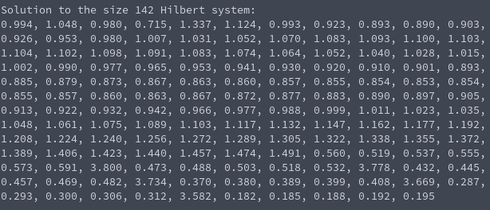

# Tasksheet 7 - Task 2
I tested the method of steepest descent on a series of Hilbert matrices. To ensure that there was a specific solution I was looking for to test against, I multiplied the Hilbert matrix for that specific size of matrix into a vector of ones to create the "b" vector, so that the solution should always be a vector of ones.

I tested Hilbert matrices up to size 150 and saw where about the solving started to break down. Here is a screen shot of the point where it started to
not have solutions similar to 1.

Out of interest, I wanted to see if I would ever run into machine precision
issues. I let the program run up to 1000 iterations (it took about 25 minutes),
and interestingly I never saw any nonsensical output like "nan" or infinite numbers. It seems that in this case the machine precision caused issues with the solving itself, causing the numbers to stray away from one, as opposed to crashing the program.

[Here](../../software/matrix/hilbert_solve.c) is the code that was used in this task to solve the Hilbert matrix systems.
