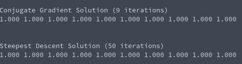

# Tasksheet 7 - Task 4

The code for this example is found [here.](../../software/matrix/sd_cg_compare.c)

A symmetric and diagonally dominant matrix of size 10 was generated, and the
solving was done with both the conjugate gradient method and the method
of steepest descent. The code that runs the linear solving method was modified to return the number of iterations to reach the solution with the specified tolerance.

The output from the console is the following:

We see that in this case, the conjugate gradient method was able to reach the same solution with a lot less number of iterations.
