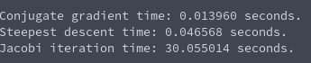

# Tasksheet 7 - Task 6
To test the time differences between the three different methods, I created a matrix of size 1000x1000 and then timed the amount of time that it took to solve each system and printed it to the console. The code that did all of this work can be found [here.](../../software/matrix/sheet7task6.c)

The output from the console is the following:

In this case, we see that the conjugate gradient method was the fastest, and Jacobi iteration for some reason did absolutely horrible.
