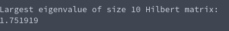

# Tasksheet 8 - Task 2

A Hilbert matrix was generated of size 10, and the power method was ran on the matrix to determine the largest eigenvalue. The code that ran all of this can be found [here.](../../software/eigen/powermethod_hilbert10.c)

The result in the console is the following:

Doing some research online, this is an eigenvalue of the size 10 Hilbert matrix, but it is not the largest one.
The Hilbert matrix causes all sorts of problems, so it is to be expected that the power method will not
work as smoothly as it did for our symmetric and diagonally dominant one.
