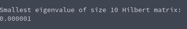

# Tasksheet 8 - Task 4

A Hilbert matrix was generated of size 10, and the inverse power method was ran on the matrix to determine the smallest eigenvalue. The code that ran all of this can be found [here.](../../software/eigen/inversepowermethod_hilbert10.c)

The result in the console is the following:

Examining this output, I am almost certain that we don't have enough precision to represent the smallest eigenvalue of the size 10 Hilbert matrix. The precision cuts off around the precision that the double type offers, so we will need some modifications to our current algorithm if we wish to find what the true smallest eigenvalue of the size 10 Hilbert matrix is.
