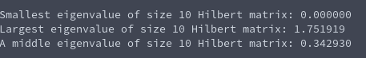

# Tasksheet 8 - Task 6

The code referenced and used in this task can be found [here.](../../software/eigen/shiftpowermethod_hilbert10.c)

A Hilbert matrix was generated of size 10, and then the smallest and largest
eigenvalues were found, using the inverse power method and power method
respectively. Then, the average between the two was used to be an initial
guess to the shifted power method.

The console output returned the following:

Even though this strategy of finding the largest and smallest eigenvalues, then using
the average to have an initial guess at a middle eigenvalue would work under most matrices,
the largest and smallest eigenvalues of the Hilbert matrix both had problems as
seen in tasks 2 and 4, so we can't use this approach to find a middle value.

Doing some research online, the value 2.53089 is a known eigenvalue of the
Hilbert matrix, so I will see if an initial guess of 2.50 will converge to that
solution with my shifted power method.

Here is the console output from this attempt:

That definitely did not work, so once again, the Hilbert matrix causes nasty problems.
