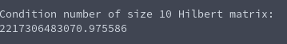

# Tasksheet 8 - Task 8

In this task, I generated the size ten Hilbert matrix, then attempted to find
the condition number of the matrix.

[Here](../../software/eigen/conditionnumber_hilbert10.c) is the code that I used to do this.

The output from the console after running this code is the following:

This seems like an incredibly nonsensical output, so it probably did not work out
very well. The reason that it didn't work is that the smallest eigenvalue
for this matrix was previously found to be about 0, so there was some sort of
divide by 0 error that was occurring when finding the condition number.
