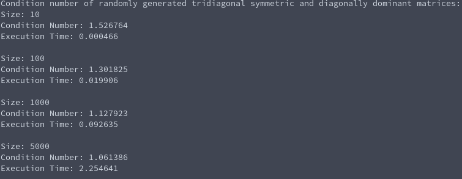

# Tasksheet 8 - Task 9

For this task, I wrote up code that will perform the tridiagonal variant of the condition number, the inverse power method, and the power method. The software manual pages for these can be found here:

* [Condition Number (Tridiagonal Matrix)](../../software_manual/mtx_tridiag_conditionnumber.md)
* [Power Method (Tridiagonal Matrix)](../../software_manual/mtx_tridiag_powermethod.md)
* [Inverse Power Method (Tridiagonal Matrix)](../../software_manual/mtx_tridiag_inversepowermethod.md)

In [this code](../../software/eigen/tridiagonal_condition_example.c), I randomly generated tridiagonal matrices that are symmetric and diagonally dominant, and then computed the condition number and found the time that was needed to compute it. I did it for four different sizes of matrices: 10, 100, 1000, and 5000.

The original task sheet asked us to do a matrix of size 10000 for the last matrix, but my computer ran out of memory and crashed when I allocated that much memory to create a matrix. Since my computer wouldn't let me use C to allocate that much memory, I simply replaced it with size 5000 and it worked like a charm.

Here is the output from the code:

As expected, the 5000x5000 matrix was the one that took the longest to compute the condition number of.
